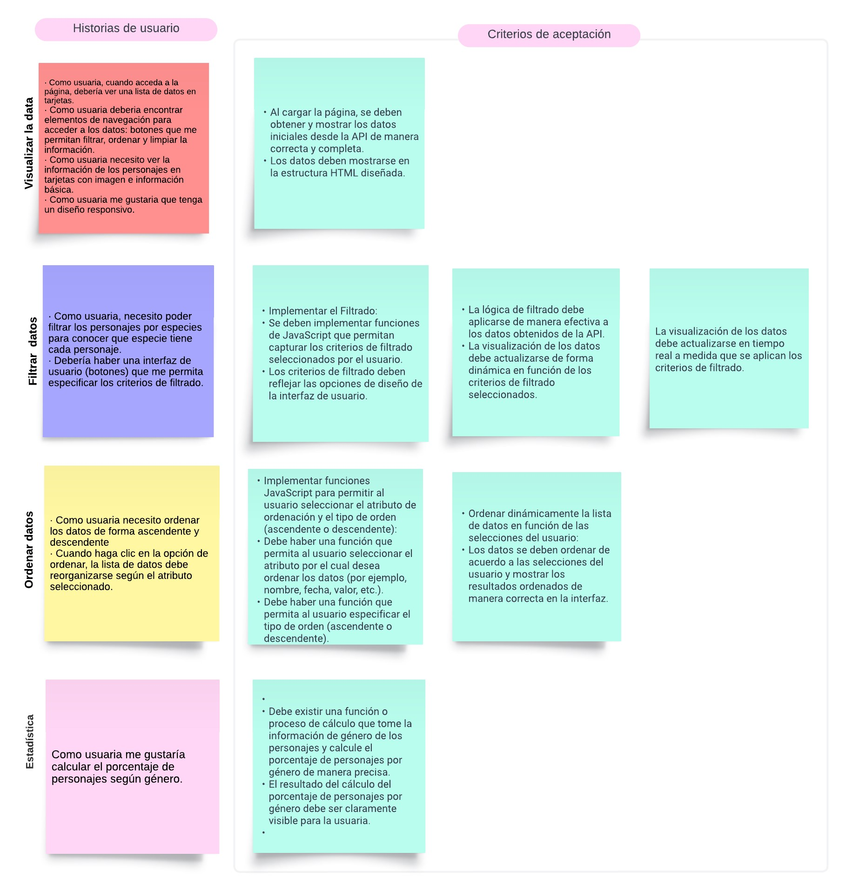
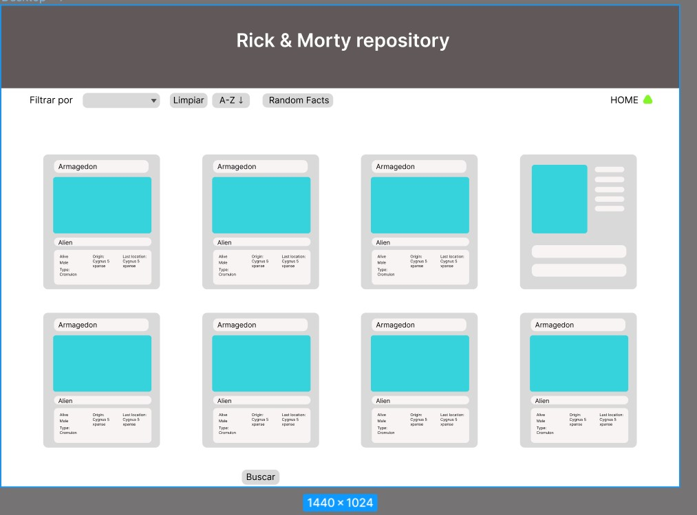
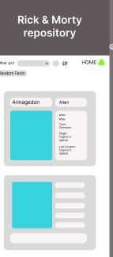
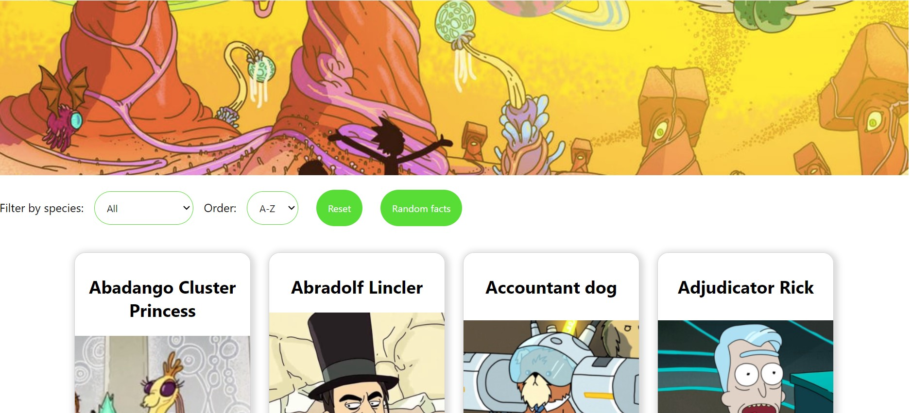
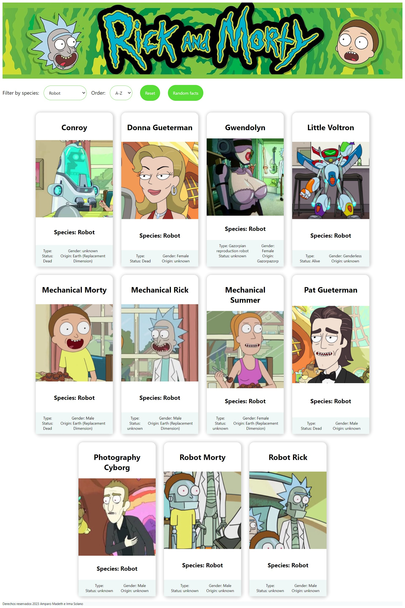

# Data Lovers

## Índice

* [1. Introducción](#1-Introducción)
* [2. Resumen del proyecto](#2-resumen-del-proyecto)
* [3. Historias de usuaria](#3-Historias-de-usuaria)
* [4. Proceso de diseño](#4-Proceso-de-diseño)
* [5. Pruebas de usabilidad](#5-Pruebas-de-usabilidad)
* [6. Versión final](#6-Versión-final)
***

## 1. Introducción

¡Bienvenida a la página de "Rick and Morty" dedicada a las fascinantes especies de los personajes! Sumérgete en el vasto multiverso de la serie y descubre las diversas y a menudo extravagantes criaturas que habitan en él.

En "Rick and Morty", el protagonista, Rick Sanchez, junto a su nieto Morty Smith, exploran innumerables dimensiones y mundos, cada uno poblado por seres únicos y extraños. En la página podrás conocer las distintas especies de los personajes y asi adentrarte en el loco multiverso.

## 2. Resumen del proyecto

La página está diseñada para mostrar todos los personajes de "Rick and Morty", permitiéndo filtrar las los personajes de acuerdo a su especie.

La herramienta de filtrado permitirá explorar las especies de acuerdo al interés de la usuaria, ya sea que quiera profundizar en los misteriosos Cronenbergs o conocer más sobre los bizarros humanoides. Además, podrá organizar la lista de personajes tanto en orden ascendente como descendente.

En cada tarjeta de personaje, encontrará detalles adicionales que ayudarán a comprender mejor el multiverso de "Rick and Morty". ¡

## 3. Historias de usuaria

 

## 4. Proceso de diseño
Se comenzó con el diseño del prototipo de baja fidelidad:

## 5. Pruebas de usabilidad
Las sugerencias que recibimos para mejorar la usabilidad fueron las siguientes:
- La imagen del header contrasta con el color del título.
- Las imágenes están descentradas.
- Las tarjetas no tienen el mismoz
- El idioma para presentar la información está mezclado, se mezcla el inglés y el español.

## 6. Versión final. 
Después de implementar las sugerencias la versión final es la siguiente:

